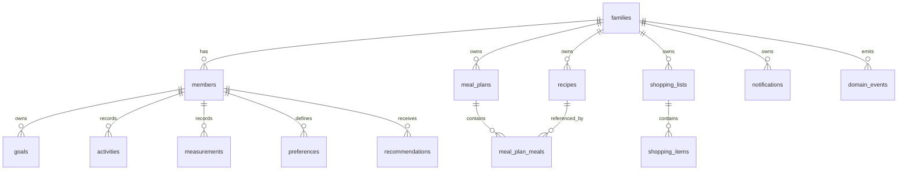

# MealPilot Data Model v1

## Purpose

This document defines the initial PostgreSQL/Supabase data model for the MealPilot MVP.

The model follows these decisions:

- Family as Tenant
- Domain First
- Modular Monolith
- CRUD + Event Store
- Meal First
- Member-owned goals, activities, measurements, and preferences
- Family-owned meal plans and shopping lists

---

## Entity Relationship Overview



---

## Tables

### families

Represents the tenant boundary.

```sql
create table families (
  id uuid primary key default gen_random_uuid(),
  name text not null,
  timezone text not null default 'America/Argentina/Salta',
  created_at timestamptz not null default now(),
  updated_at timestamptz not null default now()
);
```

---

### members

Represents a person inside a family.

```sql
create table members (
  id uuid primary key default gen_random_uuid(),
  family_id uuid not null references families(id) on delete cascade,
  display_name text not null,
  role text not null check (role in ('owner', 'adult', 'child', 'professional')),
  birth_date date,
  height_cm numeric(5,2),
  is_active boolean not null default true,
  created_at timestamptz not null default now(),
  updated_at timestamptz not null default now()
);
```

Indexes:

```sql
create index idx_members_family_id on members(family_id);
create index idx_members_family_role on members(family_id, role);
```

---

### goals

Member-owned goals.

```sql
create table goals (
  id uuid primary key default gen_random_uuid(),
  family_id uuid not null references families(id) on delete cascade,
  member_id uuid not null references members(id) on delete cascade,
  goal_type text not null,
  title text not null,
  target_value numeric,
  target_unit text,
  status text not null default 'active' check (status in ('active', 'paused', 'completed', 'cancelled')),
  start_date date,
  target_date date,
  metadata jsonb not null default '{}'::jsonb,
  created_at timestamptz not null default now(),
  updated_at timestamptz not null default now()
);
```

Indexes:

```sql
create index idx_goals_family_member on goals(family_id, member_id);
create index idx_goals_status on goals(status);
```

---

### activities

Physical activity records.

```sql
create table activities (
  id uuid primary key default gen_random_uuid(),
  family_id uuid not null references families(id) on delete cascade,
  member_id uuid not null references members(id) on delete cascade,
  activity_type text not null,
  duration_minutes integer,
  distance_meters integer,
  intensity text check (intensity in ('low', 'medium', 'high')),
  notes text,
  occurred_at timestamptz not null,
  created_at timestamptz not null default now()
);
```

Indexes:

```sql
create index idx_activities_member_occurred_at on activities(member_id, occurred_at desc);
create index idx_activities_family_occurred_at on activities(family_id, occurred_at desc);
```

---

### measurements

Member measurements such as weight.

```sql
create table measurements (
  id uuid primary key default gen_random_uuid(),
  family_id uuid not null references families(id) on delete cascade,
  member_id uuid not null references members(id) on delete cascade,
  measurement_type text not null,
  value numeric not null,
  unit text not null,
  notes text,
  measured_at timestamptz not null,
  created_at timestamptz not null default now()
);
```

Indexes:

```sql
create index idx_measurements_member_type_measured_at on measurements(member_id, measurement_type, measured_at desc);
```

---

### preferences

Member or family preferences.

```sql
create table preferences (
  id uuid primary key default gen_random_uuid(),
  family_id uuid not null references families(id) on delete cascade,
  member_id uuid references members(id) on delete cascade,
  preference_type text not null,
  key text not null,
  value text not null,
  weight integer not null default 0,
  metadata jsonb not null default '{}'::jsonb,
  created_at timestamptz not null default now(),
  updated_at timestamptz not null default now(),
  unique(family_id, member_id, preference_type, key, value)
);
```

Examples:

- liked_food
- disliked_food
- blocked_recipe
- favorite_recipe
- cooking_constraint
- dietary_preference

---

### recipes

Reusable meal preparation definitions.

```sql
create table recipes (
  id uuid primary key default gen_random_uuid(),
  family_id uuid references families(id) on delete cascade,
  name text not null,
  description text,
  instructions text,
  prep_minutes integer,
  cook_minutes integer,
  servings integer,
  tags text[] not null default '{}',
  ingredients jsonb not null default '[]'::jsonb,
  nutrition jsonb not null default '{}'::jsonb,
  source text not null default 'user',
  created_at timestamptz not null default now(),
  updated_at timestamptz not null default now()
);
```

Indexes:

```sql
create index idx_recipes_family_id on recipes(family_id);
create index idx_recipes_tags on recipes using gin(tags);
```

---

### meals

First-class meal definitions.

```sql
create table meals (
  id uuid primary key default gen_random_uuid(),
  family_id uuid references families(id) on delete cascade,
  recipe_id uuid references recipes(id) on delete set null,
  name text not null,
  meal_type text not null check (meal_type in ('breakfast', 'morning_snack', 'lunch', 'afternoon_snack', 'dinner')),
  description text,
  tags text[] not null default '{}',
  nutrition jsonb not null default '{}'::jsonb,
  metadata jsonb not null default '{}'::jsonb,
  created_at timestamptz not null default now(),
  updated_at timestamptz not null default now()
);
```

---

### meal_plans

Weekly family meal plans.

```sql
create table meal_plans (
  id uuid primary key default gen_random_uuid(),
  family_id uuid not null references families(id) on delete cascade,
  name text not null,
  week_start_date date not null,
  status text not null default 'draft' check (status in ('draft', 'active', 'archived')),
  generated_by text not null default 'ai' check (generated_by in ('user', 'ai', 'system')),
  created_at timestamptz not null default now(),
  updated_at timestamptz not null default now(),
  unique(family_id, week_start_date)
);
```

---

### meal_plan_meals

Scheduled meals inside a meal plan.

```sql
create table meal_plan_meals (
  id uuid primary key default gen_random_uuid(),
  family_id uuid not null references families(id) on delete cascade,
  meal_plan_id uuid not null references meal_plans(id) on delete cascade,
  meal_id uuid references meals(id) on delete set null,
  recipe_id uuid references recipes(id) on delete set null,
  member_id uuid references members(id) on delete set null,
  scheduled_date date not null,
  meal_type text not null check (meal_type in ('breakfast', 'morning_snack', 'lunch', 'afternoon_snack', 'dinner')),
  title text not null,
  notes text,
  status text not null default 'planned' check (status in ('planned', 'accepted', 'consumed', 'skipped', 'replaced')),
  created_at timestamptz not null default now(),
  updated_at timestamptz not null default now()
);
```

Indexes:

```sql
create index idx_meal_plan_meals_plan on meal_plan_meals(meal_plan_id);
create index idx_meal_plan_meals_family_date on meal_plan_meals(family_id, scheduled_date);
create index idx_meal_plan_meals_member_date on meal_plan_meals(member_id, scheduled_date);
```

---

### recommendations

Stores recommendation results and scoring context.

```sql
create table recommendations (
  id uuid primary key default gen_random_uuid(),
  family_id uuid not null references families(id) on delete cascade,
  member_id uuid references members(id) on delete set null,
  meal_type text not null,
  recommended_meal_id uuid references meals(id) on delete set null,
  recommended_recipe_id uuid references recipes(id) on delete set null,
  score integer not null,
  reason_codes text[] not null default '{}',
  candidate_context jsonb not null default '{}'::jsonb,
  llm_response jsonb not null default '{}'::jsonb,
  status text not null default 'generated' check (status in ('generated', 'accepted', 'rejected', 'expired')),
  created_at timestamptz not null default now()
);
```

---

### shopping_lists

Family shopping lists.

```sql
create table shopping_lists (
  id uuid primary key default gen_random_uuid(),
  family_id uuid not null references families(id) on delete cascade,
  meal_plan_id uuid references meal_plans(id) on delete set null,
  title text not null,
  period_start date,
  period_end date,
  status text not null default 'draft' check (status in ('draft', 'active', 'completed', 'archived')),
  created_at timestamptz not null default now(),
  updated_at timestamptz not null default now()
);
```

---

### shopping_items

Items inside a shopping list.

```sql
create table shopping_items (
  id uuid primary key default gen_random_uuid(),
  family_id uuid not null references families(id) on delete cascade,
  shopping_list_id uuid not null references shopping_lists(id) on delete cascade,
  name text not null,
  category text,
  quantity numeric,
  unit text,
  checked boolean not null default false,
  source text not null default 'meal_plan',
  metadata jsonb not null default '{}'::jsonb,
  created_at timestamptz not null default now(),
  updated_at timestamptz not null default now()
);
```

Indexes:

```sql
create index idx_shopping_items_list on shopping_items(shopping_list_id);
create index idx_shopping_items_family_checked on shopping_items(family_id, checked);
```

---

### notifications

Action-oriented reminders.

```sql
create table notifications (
  id uuid primary key default gen_random_uuid(),
  family_id uuid not null references families(id) on delete cascade,
  member_id uuid references members(id) on delete set null,
  notification_type text not null,
  title text not null,
  body text,
  scheduled_at timestamptz not null,
  channel text not null default 'in_app',
  status text not null default 'scheduled' check (status in ('scheduled', 'sent', 'cancelled', 'failed')),
  action_type text,
  action_payload jsonb not null default '{}'::jsonb,
  created_at timestamptz not null default now(),
  updated_at timestamptz not null default now()
);
```

---

### domain_events

Append-only event store.

```sql
create table domain_events (
  id uuid primary key default gen_random_uuid(),
  family_id uuid not null references families(id) on delete cascade,
  member_id uuid references members(id) on delete set null,
  aggregate_type text not null,
  aggregate_id uuid,
  event_type text not null,
  payload jsonb not null default '{}'::jsonb,
  metadata jsonb not null default '{}'::jsonb,
  occurred_at timestamptz not null default now(),
  created_at timestamptz not null default now()
);
```

Indexes:

```sql
create index idx_domain_events_family_created_at on domain_events(family_id, created_at desc);
create index idx_domain_events_member_created_at on domain_events(member_id, created_at desc);
create index idx_domain_events_type_created_at on domain_events(event_type, created_at desc);
create index idx_domain_events_payload on domain_events using gin(payload);
```

---

## MVP Seed Example

```text
Family: Javier Family
Members:
- Javier: owner, lose weight, swimming Monday/Wednesday/Friday
- Wife: adult, lose weight
- Pedro: child, healthy eating habits
```

---

## Notes

- Nutrition data may be stored as JSONB but must not drive a calorie-counting UX in MVP.
- Family ID is duplicated across child tables to simplify tenant filtering and row-level security.
- Domain events are append-only and should not be edited.
- Google Calendar and Drive are integrations, not the source of truth.
